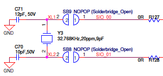
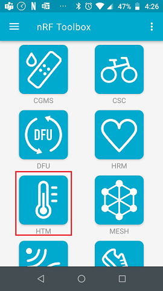
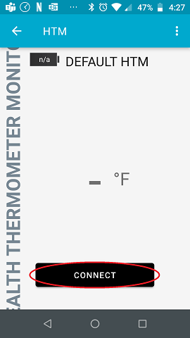
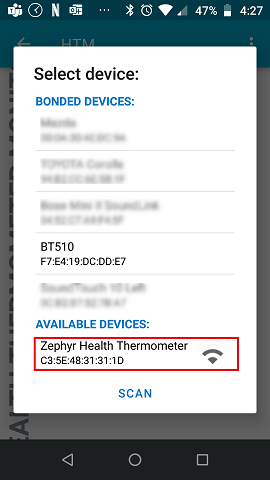
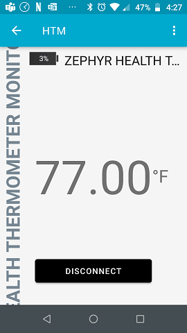

# Enabling the 32kHz Crystal on the BL65x Dev Kit

For designs that require the least amount of current consumption, it's recommended that you use an external +/- 20ppm 32.768kHz crystal. Laird's BL65x dev kit comes with the 32.768kHz crystal. However, the default setting is not connected (i.e. configured for the internal RC). This tutorial will show you how to connect the 32.768 kHz, and then build the Health Thermometer sample app so that it works with the external 32.768kHz crystal.


1. Prerequisites

   - You have followed our [Zephyr Getting Started Guide](ubuntu.md).

   - Install [nRF Toolbox](https://www.nordicsemi.com/Software-and-tools/Development-Tools/nRF-Toolbox) into an Android or iOS device.

     

2. Connect the 32.768kHz Crystal

   - Unsolder R127 and R128 from the dev kit

   - Short Solder Bridge SB8 and SB9

     

     

     

3. Modify the bl65x_dvk_defconfig file

   For BL652, modify  ~/zephyrproject/zephyr/boards/arm/bl652_dvk/bl652_dvk_defconfig 

   For BL653, modify  ~/zephyrproject/zephyr/boards/arm/bl653_dvk/bl653_dvk_defconfig 

   For BL654, modify  ~/zephyrproject/zephyr/boards/arm/bl654_dvk/bl654_dvk_defconfig

    

   Unmodified 32kHz Clock Setting (i.e. set for internal RC):

   ```
   # 32kHz clock source 
   CONFIG_CLOCK_CONTROL_NRF_K32SRC_RC=y 
   CONFIG_CLOCK_CONTROL_NRF_K32SRC_500PPM=y 
   ```

   

   Modified 32kHz Clock Setting (i.e. set for external 32kHz Crystal):

   Enable the external crystal by simply commenting out the 2 lines shown below.

   ```
   # 32kHz clock source 
   # CONFIG_CLOCK_CONTROL_NRF_K32SRC_RC=y 
   # CONFIG_CLOCK_CONTROL_NRF_K32SRC_500PPM=y 
   ```

   

4. Build the Health Thermometer App

   - Build for BL652

     ```
     cd ~/zephyrproject/zephyr
     west build -p auto -b bl652_dvk samples/bluetooth/peripheral_ht 
     ```

   - Build for BL653

     ```
     cd ~/zephyrproject/zephyr
     west build -p auto -b bl653_dvk samples/bluetooth/peripheral_ht
     ```

   - Build for BL654

     ```
     cd ~/zephyrproject/zephyr
     west build -p auto -b bl654_dvk samples/bluetooth/peripheral_ht
     ```


5. Flash the build

   - Connect PC to USB2 port of the dev kit

   - Flash the build

     ```
     nrfjprog -e
     west flash
     ```
     
     After flashing, the module should automatically go into advertising mode.
     
     


6. Connect to the module using nRF Toolbox

   - Launch nRFToolbox and then click HTM icon

     

     

   - Click connect 

     

     

   - Select the Zephyr Health Thermometer device

     

   - Temp shown

     

     

   

